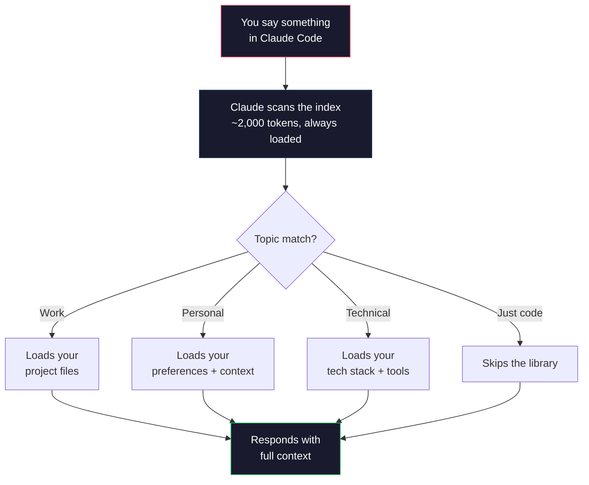
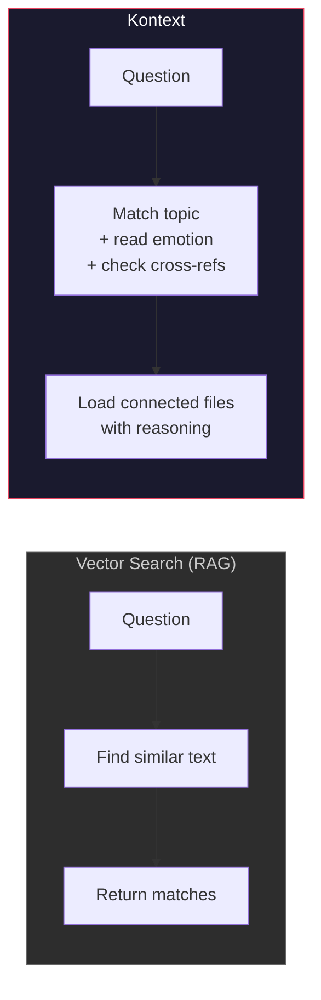
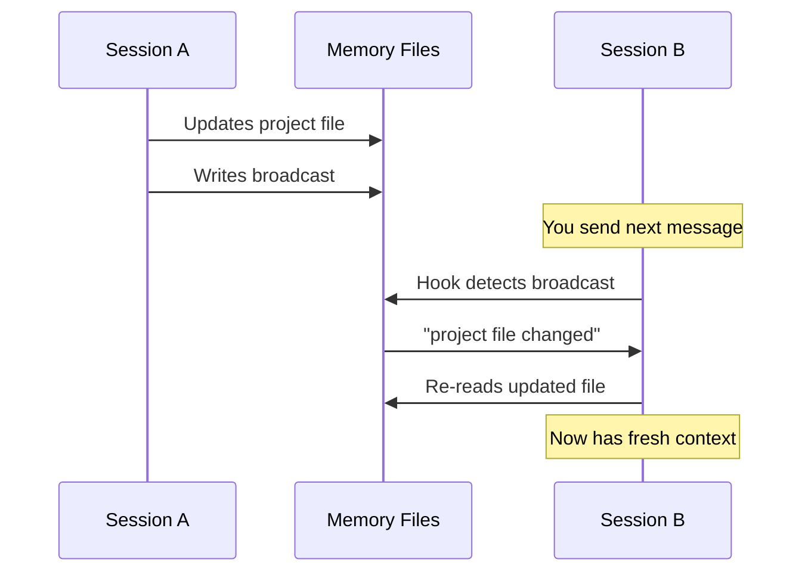
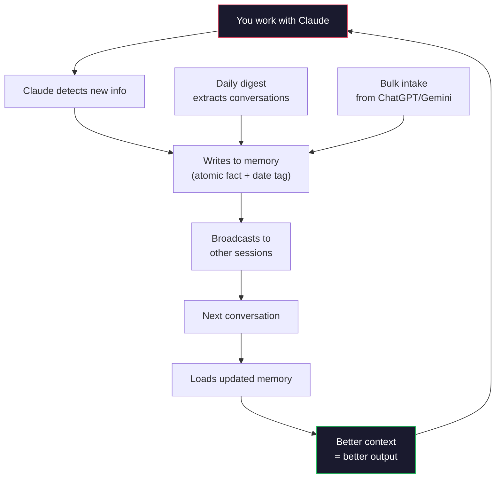

<div align="center">

# Kontext

### The memory that makes Claude remember you.

Every conversation starts from zero. Kontext changes that.

<br>


<br>

[Quick Start](#quick-start) · [How It Works](#how-it-works) · [Commands](#commands) · [Import History](#import-your-history) · [FAQ](#faq)

</div>

<br>

---

<br>

## The Problem

You open Claude Code. You explain your project. You describe your preferences. You give context about your situation. Claude gives a great answer.

Next session: Claude has forgotten everything. You start over.

**Every. Single. Time.**

<br>

## The Solution

Kontext stores what Claude needs to know about you in a SQLite database backed by a knowledge graph. Before responding, Claude uses MCP tools to query relevant context and answers as if it's known you for months.

> *"Your history is my edge. Starve me and I'm generic."*

SQLite database as the source of truth. Knowledge graph for entity relations. Semantic search. Score decay for stale entries. Flat markdown files auto-generated for backward compatibility.

<br>

---

<br>

## Quick Start

```bash
git clone https://github.com/numarulunu/kontext.git
cd kontext
./setup.sh
```

Then in Claude Code:

```
/kontext onboard
```

Answer a few questions. Claude builds your memory library. Done.

<br>

---

<br>

## How It Works

<br>



<br>

### Three layers of memory

| Layer | What it does | When it runs |
|:---|:---|:---|
| **Real-time** | Claude watches every message for facts, decisions, corrections — writes them to memory immediately | Every conversation, always on |
| **Daily digest** | Script extracts yesterday's conversations, Claude processes them next session | Automated via Task Scheduler / cron |
| **Bulk intake** | Import your entire ChatGPT, Gemini, or WhatsApp history | On demand |

Nothing falls through the cracks.

<br>

---

<br>

## Not a Search Engine. A Librarian.

Most AI memory systems use vector search — find text that *looks similar* to your question.

Kontext uses reasoning — it understands *why* things connect, reads your emotional state, and pulls files you didn't ask for but need.

<br>



<br>

| | Vector Search (RAG) | **Kontext** |
|:---|:---|:---|
| Finds relevant content | By math similarity | By meaning + reasoning |
| Knows *why* files connect | No | **Yes** — cross-reference map |
| Detects emotional state | No | **Yes** — loads different files when stressed vs. building |
| Tracks freshness | No | **Yes** — timestamps per entry |
| Multi-hop retrieval | No | **Yes** — file A leads to file B |
| Requires infrastructure | Vector DB + embeddings | **SQLite + text files** |
| Human-readable | No | **Yes** — plain markdown |

<br>

---

<br>

## What Gets Stored

Kontext creates files based on **your life** — not a fixed template.

| Example file | What it holds | When Claude reads it |
|:---|:---|:---|
| `user_profile.md` | Who you are, tools, background | Most conversations |
| `active_projects.md` | What you're building, statuses | Work discussions |
| `feedback_rules.md` | How Claude should behave | Tone-sensitive moments |
| `work_context.md` | Job, team, stack, deadlines | Work problems |
| `learning.md` | What you're studying, progress | Learning topics |
| `habits.md` | Routines, patterns, blockers | When you're stuck |

Start with 3 files. Grow to 100. Each one is a page in your library.

More pages = more precision, not more cost.

<br>

### The Index — Your Card Catalog

Every file gets a keyword-rich one-liner in `MEMORY.md`:

```markdown
- [Work Context](work.md) — senior dev at Acme, React/Node, deadline March 15, team of 4
- [Side Projects](projects.md) — budgeting app (80% done), blog (stalled), CLI tool
- [How I Work](feedback.md) — short answers, no emojis, explain tradeoffs, push to ship
```

Claude reads this index (~2,000 tokens) every conversation. Matches your topic to the right files instantly.

<br>

### Cross-References

The index maps connections between files:

```
work ←→ projects (same stack, competing for time)
habits ←→ goals (procrastination blocks projects)
feedback ←→ work (tone changes when debugging vs. planning)
```

> If Claude loads the work file because you mentioned a deadline, it also checks the habits file — there might be a procrastination pattern that's relevant.

<br>

### Emotional Routing

```
User sounds stressed    → load habits + interaction rules
User sounds stuck       → load habits + goals
User sounds excited     → load projects (ride the momentum)
```

No keyword matching needed. Claude reads the room.

<br>

---

<br>

## Commands

```
/kontext onboard          Build your library from a conversation
/kontext process-digest   Absorb recent conversations into memory
/kontext process-intake   Ingest ChatGPT, Gemini, WhatsApp exports
/kontext brainstorm       Health check + guided cleanup
/kontext status           Quick overview
/kontext resolve          Handle contradictions between sources
/kontext prompts          Search recent prompts captured by hooks
```

Or say it naturally — *"update my memory"*, *"clean up memory"*, *"how's my library"* — Claude invokes the right command.

<br>

---

<br>

## Cross-Session Sync

Running multiple sessions? Kontext keeps them connected.



Changes propagate to **all** active sessions automatically. No manual refresh.

<br>

---

<br>

## Import Your History

Years of AI conversations? Kontext ingests them.

```bash
# Drop files into intake/
cp conversations.json kontext/intake/chatgpt/
cp gemini-export.txt  kontext/intake/gemini/
cp whatsapp-chat.txt  kontext/intake/whatsapp/

# Parse and chunk (no AI, runs in seconds)
python pipeline/extract.py

# In Claude Code:
/kontext process-intake
```

<br>

### Supported Formats

| Format | Source | File type |
|:---|:---|:---|
| ChatGPT | Settings > Data Controls > Export | `.json` or `.zip` |
| Gemini | Copy-paste conversations | `.txt` `.md` |
| WhatsApp | Chat > Export | `.txt` |
| Documents | Any text content | `.txt` `.md` `.pdf` |

<br>

### The Grading System

Not everything is worth remembering. Each chunk gets scored 1-10:

| Grade | Meaning | Destination |
|:---|:---|:---|
| **8-10** | Decisions, facts, preferences | Active memory |
| **5-7** | Useful context, patterns | Historical section |
| **1-4** | Small talk, debugging, noise | Dropped |

Filters ~60-70% of raw data before Claude sees it.

<br>

---

<br>

## Memory Architecture

<br>

### Tiered Storage

Every entry has an implicit tier:

| Tier | Where | When |
|:---|:---|:---|
| **Hot** | Active section | Recently written or accessed |
| **Warm** | Historical section | Valuable but untouched 60+ days |
| **Cold** | Compressed one-liners | 120+ days, grade 5-6 only |

High-value entries (grade 7+) never compress, regardless of age.

<br>

### Atomic Facts

Memory is stored as single facts, not paragraphs:

```markdown
# Good
- [2026-04] Active students: 24 paying
- [2026-04] Lesson rate: EUR120-150 single (decoy)
- [2026-04] Package: EUR380 / 4 sessions (~EUR95/hr)

# Bad
- User has 24 students, charges EUR120-150 for singles
  and EUR380 for packages, uses Stripe and Lunacal,
  migrating off Preply
```

One fact per line. Faster to scan. Easier to update. More precise to retrieve.

<br>

### Temporal Tracking

When a fact changes, the old version moves to Historical:

```markdown
## Active
- [2026-04] Active students: 24 paying

## Historical
- [2026-03] Had 27 active students
- [2025-12] Had 15 active students
```

Claude can answer *"how has X changed over time?"* by reading the trail.

<br>

### Conflict Resolution

When sources disagree, Kontext logs it and asks you:

```
CONFLICT: Current tech stack
  Version A (ChatGPT 2024): "React 17 + Express"
  Version B (Claude 2026): "Migrated to Next.js 15"
  
  Keep A, keep B, merge, or skip?
```

Your decisions train a pattern library. After 3+ consistent decisions in the same category, Kontext auto-resolves similar conflicts.

<br>

---

<br>

## How Memory Grows



<br>

---

<br>

## Semantic Search

Kontext includes a local MCP server that finds the right memory files by meaning, not just keywords.

Say *"everything feels heavy and I can't start anything"* — Kontext matches it to your psychology file, your blind spots, and your goals. No keyword overlap needed. It understands what you mean.

Runs locally on your machine. Retrieval stays local. Optional cloud sync can replicate history across devices, but embeddings and ranking remain local. Embeddings are cached — re-indexes only when descriptions change.

<br>

---

<br>

## Project Structure

```
kontext/
  setup.sh                 One-command installer
  install_hooks.py         Cross-session sync setup
  mcp_server.py            MCP server — semantic search + database tools
  db.py                    SQLite database — CRUD, graph, sessions, decay
  migrate.py               Import flat memory files into database
  export.py                Export database to backward-compatible markdown
  graph.py                 Knowledge graph — entity extraction and relations
  cloud/                   Optional control plane, client, daemon, and replay helpers
  sync.py                  Startup sync — pulls cloud history, then imports file edits
  kontext.db               SQLite database (auto-created on first use)
  SKILL.md                 /kontext skill for Claude Code
  templates/               Starter files for new users
  pipeline/                Intake processing engine
  tests/                   Pytest suite — local and cloud coverage
```

<br>

---

<br>

## Optional: Multi-device Sync

**Kontext runs fully local by default.** SQLite, semantic search, knowledge
graph, dream, digest — all work offline with no cloud anywhere. You only need
the section below if you want your memory to follow you across multiple
devices (laptop + desktop, etc.).

If you never link a cloud, `sync.py` logs a one-line warning and everything
else keeps working. No account, no signup, no VPS required.

<details>
<summary><strong>Self-host the sync server (optional)</strong></summary>
<br>

Want cross-device sync without paying for a managed service? Run the Kontext
control plane on any Docker-capable VPS in ~15 minutes. Full walkthrough in
[`docs/runbooks/kontext-vps-deployment.md`](docs/runbooks/kontext-vps-deployment.md).

The sync API is served on your public domain behind Caddy auto-TLS. The
**dashboard is bound to `127.0.0.1` on the VPS and blocked at the public
domain** — reach it by SSH-tunneling port 8200:

```bash
ssh -L 8200:localhost:8200 user@your-vps
# then open http://localhost:8200/dashboard in your browser
```

Close the SSH session to "log out" — nothing is exposed publicly, no auth gate
needed.

</details>

<br>

---

<br>

## Pairs Well With

| Tool | What it adds |
|:---|:---|
| [Claude Backup System](https://github.com/numarulunu/claude-backup-system) | Daily conversation digests that feed Kontext |
| [pocketDEV](https://github.com/numarulunu/claude-tool-auditor) | Weekly project health checks |

<br>

---

<br>

## FAQ

<details>
<summary><strong>Does this work with Claude.ai (browser)?</strong></summary>
<br>
No. Claude.ai loads all context every turn — no selective retrieval. Kontext requires Claude Code CLI.
</details>

<details>
<summary><strong>How much does memory cost in tokens?</strong></summary>
<br>
The index costs ~2,000 tokens per turn. Each loaded file costs ~500-1,500 tokens. Compare to stuffing everything into CLAUDE.md: that costs the full file size every single turn. Kontext is 80-95% cheaper.
</details>

<details>
<summary><strong>Can I have too many files?</strong></summary>
<br>
The index caps at ~200 lines. In practice, 20-100 files covers most use cases. More files = more precision, not more cost. Claude loads 4-6 per conversation.
</details>

<details>
<summary><strong>Does Claude update memory automatically?</strong></summary>
<br>
Yes — it watches every message for new info and writes immediately. A daily digest catches anything missed. Bulk intake lets you import your entire history from any platform.
</details>

<details>
<summary><strong>Can I read and edit my memory files?</strong></summary>
<br>
Yes. Plain markdown in ~/.claude/projects/*/memory/. Open in any text editor.
</details>

<details>
<summary><strong>Is my data sent anywhere?</strong></summary>
<br>
No. Everything stays on your machine. The only external connection is if you choose to back up to a private GitHub repo.
</details>

<br>

---

<br>

<div align="center">

*Your history is my edge. Starve me and I'm generic.*

<br>

**[MIT License](LICENSE)**

</div>
